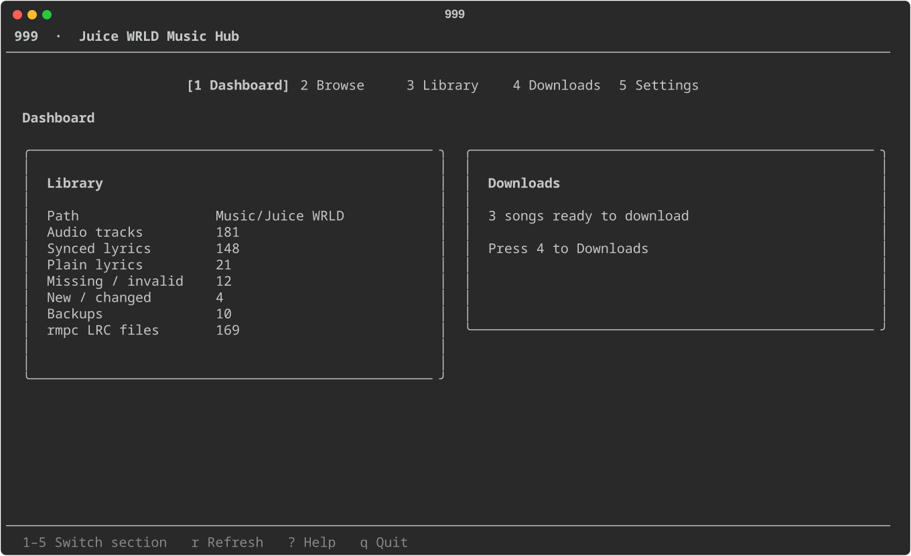

# 999

A terminal-native Juice WRLD music hub for Linux, with cautious lyrics
management for local MP3, FLAC, and M4A libraries and synchronized `.lrc`
sidecars for rmpc.

> **Beta release:** `2.0.0b1` is the first beta of the redesigned `999`.
> Keep a separate backup of valuable media and review every confirmed repair.
> This release is distributed from its immutable Git tag, not a package index.

999 uses the Juice WRLD API as a catalogue and lyrics source. MP3 supports
plain and synchronized embedded lyrics; FLAC and M4A use standard plain lyric
tags. Genuine synchronized lyrics for every supported format use an adjacent
same-basename `.lrc` file.

This is an unofficial fan-made tool. It is not affiliated with or endorsed by
Juice WRLD's estate, record labels, or the Juice WRLD API. The repository does
not include music or lyric content; users are responsible for the media and
services they access.

## Preview



_Captured from the real TUI with synthetic counts and a generic path. It
contains no user library or state data._

## The simple workflow

### First time

```bash
999
```

This opens the TUI. Missing configuration or library folders are reported in
the interface without changing rmpc or starting a download.

Configuration is optional. To write a starter configuration, or explicitly
configure rmpc later:

```bash
999 config init
999 rmpc setup
```

Your Juice WRLD folder is kept together:

```text
~/Music/Juice WRLD/
├── Unreleased/
│   ├── Bottle.mp3
│   ├── Bottle.lrc
│   ├── Rental.mp3
│   ├── Rental.lrc
│   └── ...
```

### Normal use

Open `999`, choose **Library**, then press `s` for **Sync Library**. It discovers
new, changed, and removed local tracks, identifies confident catalogue matches,
and updates the Library view without changing audio or lyrics. Press `a` for
**Issues**, the snapshot-backed list of tracks that still need a decision or
repair. Press `d` for a read-only **Duplicates** view showing exact file copies
and conservative probable-recording groups with their evidence and paths.
Press `g` for **Missing Library**, an exact catalogue-ID comparison that keeps
alternate versions distinct and labels partial/offline catalogue coverage.
A selected missing recording can be added to the existing Downloads queue; it
is never downloaded automatically.
**Maintain lyrics**
is the separate, explicitly approved repair action. Maintenance shows a non-mutating preview and
a cancel-first confirmation before changing audio metadata or sidecars.
Press `?` on any TUI section for a scrollable guide to every app shortcut.
The on-screen shortcut lines show the common actions; adding songs to Downloads
is immediate and never starts a download. Confirmations are reserved for bulk
downloads and high-impact changes to audio, backups, catalogue identities, or player configuration.
Library lyric coverage is determined from the local audio and a genuinely
timestamped adjacent `.lrc`; catalogue matching is shown separately because it
is needed for automatic refresh, not for recognizing already healthy lyrics.
The separate Library **Refresh** action remains a read-only local rescan.
Routine discovery and safe identity backfill belong to **Sync Library**.
When a track remains Unknown or has a wrong automatic identity, select it in
Library and press `c` to search, choose, and lock the correct catalogue
record. Press `u` to unlock and clear a manual choice so a later Sync can
reconsider it.

Duplicate review uses the already-loaded Library snapshot. It does not rescan,
contact the catalogue, or change files. Distinct versions such as live,
remix, session, extended, TV mix, and numbered versions are kept separate.
Select a track and press `e` to review metadata repair proposals. Nothing is
selected automatically: choose individual title, artist, album, or track-number
changes, then review a cancel-first confirmation. Apply creates a full audio
backup and verifies that audio, artwork, lyrics, unrelated tags, and the
adjacent sidecar were preserved. Existing values and version differences are
marked for review rather than silently replaced.

The CLI remains available for scripting and automation. `999 sync` remembers
files it has already processed, so unchanged verified files are skipped.

Useful status command:

```bash
999 status
```

Read-only diagnostics and an optional sanitized support report:

```bash
999 doctor
999 doctor --support-report
999 doctor --save-report ./999-support.json
```

Built-in guide:

```bash
999 guide
```

## What `sync` does

```text
local MP3, FLAC, or M4A
   │
   ├── match to API using title + version + API path + duration
   │
   ├── synced lyrics available ──► MP3: ID3 SYLT
   │                               FLAC: plain-text Vorbis LYRICS
   │                               M4A: plain-text MP4 ©lyr
   │                               └── adjacent rmpc .lrc (timing authority)
   │
   └── only ordinary lyrics ─────► MP3: ID3 USLT / FLAC: Vorbis LYRICS / M4A: MP4 ©lyr
```

Songs without synchronized lyrics still receive ordinary embedded lyrics. rmpc's synchronized Lyrics pane cannot display those as timed lyrics unless timestamps are available.

## Search the public catalogue

The API's catalogue can be searched without downloading media:

```bash
999 search "red dead"
999 search --category unreleased --era DRFL "moncler"
999 info "Rental"
```

`search` shows useful catalogue metadata, lyric availability, era, duration, and file path information. `info` fetches the detailed song record when possible.

The project avoids untargeted catalogue scraping; media acquisition is explicit, opt-in, and managed through persistent acquisition jobs. The media-management workflow operates on local media or explicitly acquired tracks.

## Project documentation

The repository keeps its development and continuity context in version-controlled documentation so work can safely continue across chats or coding agents:

- `AGENTS.md` — concise first-stop instructions for coding agents
- `docs/PROJECT_STATE.md` — canonical current checkpoint and roadmap
- `PROJECT_CONTEXT.md` — durable user and product context
- `docs/ROADMAP.md` — concise forward roadmap
- `docs/ARCHITECTURE.md` — component responsibilities and dependency direction
- `docs/USER_GUIDE.md` — straightforward user workflows
- `docs/DEVELOPMENT.md` — development and testing guidance
- `docs/CHANGELOG.md` — release and milestone history
- `docs/BETA_RELEASE_CHECKLIST.md` — pre-release acceptance and release steps

Before major changes, read `AGENTS.md`, `docs/PROJECT_STATE.md`, and the
relevant architecture or user document.

## Commands

| Command | Purpose |
|---|---|
| `setup` | Compatibility shortcut for an initial library sync; never rewrites rmpc |
| `sync` | Normal day-to-day library update |
| `status` | Show current library state without API calls |
| `scan` | Detailed API scan/troubleshooting |
| `embed` | Lower-level embed-only command |
| `verify` | Validate supported MP3/FLAC/M4A embedded lyrics |
| `restore` | Restore a previous audio backup |
| `doctor` | Bounded read-only health checks; optional sanitized support report |
| `completion bash/zsh/fish` | Generate completion from the current CLI command tree |
| `guide` | Show this workflow in the terminal |
| `search` | Search the public song catalogue |
| `info` | Inspect a song's API metadata |
| `acquire` | Explicitly select, queue, and acquire API media resources |
| `rmpc setup/sync/verify` | Scriptable and advanced rmpc operations; basic check/setup is also in Library |
| `config` | Manage persistent configuration |
| `cache clear` | Clear cached API responses |
| `state clean` | Preview clearly stale external state records; `--yes` backs up state before pruning |
| `state rebuild-identities` | Preview rematching current library identities; `--yes` backs up state and applies |

## Safety

Before modifying MP3, FLAC, or M4A metadata, the tool creates timestamped backups under:

```text
~/.local/share/juice-lyrics/backups/
```

Each modified file is verified after writing. If verification fails for that file, it is immediately restored from its backup.

The audio stream is never decoded/re-encoded by this tool. It edits MP3 ID3,
FLAC Vorbis, or M4A MP4 metadata and writes separate adjacent LRC text files.

For MP3, only lyric frames created by this tool (`desc = "Juice WRLD API"`) are
replaced. For FLAC, the standard `LYRICS` field is updated while unrelated
Vorbis comments are preserved. For M4A, standard `©lyr` is updated while
unrelated MP4 atoms are preserved.

State cleanup is intentionally explicit. `999 state clean` is preview-only;
`999 state clean --yes` first copies `state.json` beside itself with a
`pre-clean-...bak` suffix, then atomically removes only clearly stale external
records. It never deletes audio or LRC files.

Catalogue identity rebuilding is also preview-first. Use
`999 state rebuild-identities` to inspect its scope, then add `--yes` to rerun
the current matcher for every current library file. The operation changes only
`song_id` and `api_name`, preserves lyric state and unrelated records, and
creates a complete `state.json.pre-identity-rebuild-...bak` copy before one
atomic state write. `--refresh` bypasses otherwise-valid catalogue search cache
entries, and `--details` prints every changed mapping.

## Matching

The matcher intentionally uses several signals rather than trusting a title alone:

- explicit version (`v1`, `v2`, etc.)
- exact API filename
- exact API path filename
- title/original key
- known Juice WRLD aliases
- local audio duration vs API duration
- candidate-only version/variant penalties
- small released-category evidence
- compatible local album/API path evidence

This prevents common version mix-ups such as selecting `Starstruck (v1)` for `Starstruck (v2)`.
Known durations normally use the configured three-second tolerance. A released,
unversioned, unvaried candidate with exact base-title and compatible album/path
evidence may use a tightly bounded catalogue-metadata grace: at most two
additional seconds, five seconds total, and two percent of the local duration.
Grace receives reduced negative evidence rather than a normal duration-match
bonus; larger or weakly corroborated differences remain ineligible.

## rmpc

Audio and external synchronized lyrics stay together. A synchronized song gets
a same-basename sidecar beside its audio file:

```text
song.mp3
song.lrc
```

The old `lyrics_dir` configuration key is accepted for compatibility but is
deprecated and does not direct new output. Existing centralized files are not
moved automatically; migration is a separate, explicit operation. Sidecars work
naturally when the music tree is synchronized between devices. Embedded lyrics
remain supported.

The advanced commands remain available:

```bash
999 rmpc setup
999 rmpc sync
999 rmpc verify
```

## Configuration

Defaults are designed for the user's common Linux layout, but the library can be overridden globally:

```bash
999 config init
999 config show
```

or for a single command:

```bash
999 --path ~/Music/MyLibrary status
```

The tool follows XDG locations for its config, cache, state, and backups.

## Installation

### Recommended pipx install

```bash
pipx install "git+https://github.com/NotAI-fr/juice-lyrics.git@v2.0.0b1"
command -v 999
999 --version
999 doctor
```

The distribution remains named `juice-wrld-lyrics` for update compatibility.
The command above installs the immutable `v2.0.0b1` tag into pipx without
depending on the source checkout after installation. If pipx already has an
older or stale copy, replace it deliberately:

```bash
pipx install --force "git+https://github.com/NotAI-fr/juice-lyrics.git@v2.0.0b1"
hash -r
command -v 999
999 --version
999 doctor
```

Repeating the `--force` command is the deterministic upgrade or reinstall path
for this beta. Installing a locally built wheel is also supported:

```bash
pipx install --force /absolute/path/to/juice_wrld_lyrics-2.0.0b1-py3-none-any.whl
```

If a stale pipx registration cannot be replaced, `pipx uninstall
juice-wrld-lyrics` followed by the normal install command removes only the
isolated application environment. It does not remove 999's existing
`~/.config/juice-lyrics`, `~/.cache/juice-lyrics`, or
`~/.local/share/juice-lyrics` data.

### Editable development install

```bash
python -m venv .venv
. .venv/bin/activate
pip install -e .
```

For development checkpoints, invoke the repository environment explicitly:

```bash
.venv/bin/999
```

If `command -v 999` points at an older pipx installation, that command will not
contain current checkout changes. Reinstall it deliberately or keep using
`.venv/bin/999`; changing the repository cannot update an installed copy.

`juice-lyrics` remains available as a legacy compatibility command. Both names
run the same CLI. Existing config, state, queue, cache, and backups continue to
use the `juice-lyrics` XDG namespace so no data migration is required.

### Shell completion

Generate completion from the installed CLI after installing or updating `999`.
Generation only inspects command definitions; it does not load configuration,
state, or the catalogue.

For Bash:

```bash
mkdir -p ~/.local/share/bash-completion/completions
999 completion bash > ~/.local/share/bash-completion/completions/999
```

Start a new Bash session (with `bash-completion` enabled), or source that file.

For Zsh:

```zsh
mkdir -p ~/.zfunc
999 completion zsh > ~/.zfunc/_999
```

Add `fpath=(~/.zfunc $fpath)` before `autoload -Uz compinit && compinit` in
`~/.zshrc`, then start a new Zsh session.

For Fish:

```fish
mkdir -p ~/.config/fish/completions
999 completion fish > ~/.config/fish/completions/999.fish
```

Fish loads that file in new sessions. The generated definitions also support
the legacy `juice-lyrics` command. Regenerate them after a CLI upgrade so the
available commands and flags stay current.

## Development

Run the test suite with:

```bash
pytest -q
```


## Acquisition (Explicit Workflow)

The project includes an acquisition subsystem for explicitly selected API resources:

```bash
# 1. Search the catalogue and check downloadable resources
999 acquire search "rental"

# 2. Queue selected item(s) by 1-based index (or use --manifest)
999 acquire add "rental" --index 1

# 3. Queue from a plain-text manifest file
999 acquire manifest manifest.txt

# 4. View queued persistent jobs
999 acquire jobs

# 5. Run a persistent job (with automatic resume, size/hash checks, and post-processing)
999 acquire run <job-id>

# 6. Retry failed/pending items or delete job records
999 acquire retry <job-id>
999 acquire delete <job-id>
```

Acquisition is intentionally opt-in and operates only on explicitly selected resources. The transport downloader streams via temporary `.part` files, supports HTTP range resume, validates payload size and checksums, and integrates acquired MP3s directly with the synced/plain lyrics and rmpc workflow.
